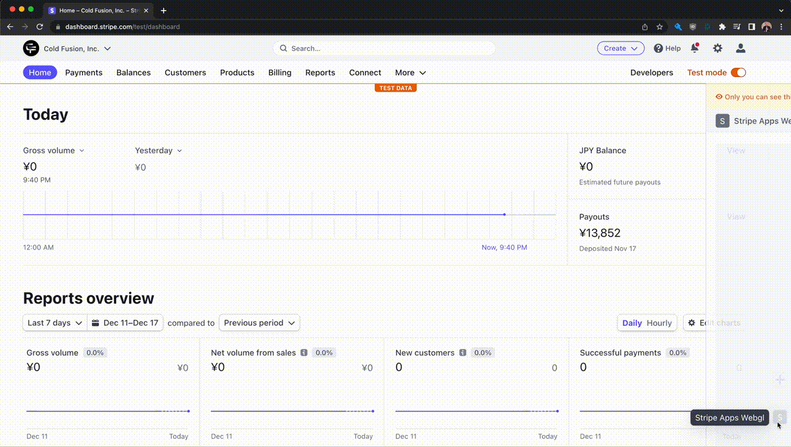

# stripe-apps-webgl

Fast, realtime, and interactive WebGL implementation within a Stripe App (using [Three.js](https://github.com/mrdoob/three.js/))

## Demo



## Prerequisites

For Homebrew on macOS,

1. Install Stripe CLI: `brew install stripe/stripe-cli/stripe`
2. Install Stripe Apps CLI plugin: `stripe plugin install apps`

For more info, see: https://stripe.com/docs/stripe-apps/create-app

## Building

1. Clone this repo
2. Run `yarn install`
3. Run `stripe login`
4. Run `stripe apps start`

## How It Works

As Stripe Apps run inside a sandboxed `iframe` and do not have direct access to the parent DOM, and there (currently) is no [Stripe UI Component](https://stripe.com/docs/stripe-apps/components) which can be used to create or obtain access to a HTML Canvas, it is not possible to *directly* render GPU output into a Stripe App.

(Note: there is [discussion](https://github.com/stripe/stripe-apps/issues/192#issuecomment-1126359398) that a `WebView` component might be added in the future, possibly post-launch.)

Stripe Apps do however support display of images, specifically images that can be shown via [data URLs](https://stripe.com/docs/stripe-apps/components/img#data-urls), which can be generated and encoded at runtime.  Using this method, we can render the WebGL output into a buffer, copy out the final rendered frame, encode the frame into an image, and display it within the app's view.

## Performance

While the performance will depend highly on the complexity of the scene being rendered, this demo of a single cube renders easily at 60fps on a Mac Studio M1 Ultra (2022), with approximately a 5-8% GPU usage increase for the `Google Chrome Helper (GPU)` process in Activity Monitor while the Stripe Dashboard tab is opened in fullscreen on a 4K display.

## Animation

Updating the app's view to show a new frame is fairly simple.  We store the output frame (encoded into a data URL) as a React state, which is referenced by the `src` attribute in the `` tag.  We then hook the renderer's `setAnimationLoop()` call via an Effect Hook when the component is created, and update the image data by changing the state, which then displays the new frame.

```
const ThreeJS = () => {
	const [renderOutput, setRenderOutput] = useState('');

	useEffect(() => {
		renderer.setAnimationLoop((time) => {
			// ...update scene here...
			renderer.render(scene, camera);
			setRenderOutput(renderer.domElement.toDataURL());
		});
	}, []);

	return (
		
	);
}
```

## Mouse Input

Receiving mouse events is as easy as hooking `onMouseMove`, however since again we are inside a sandboxed `iframe` we don't have access to the DOM, this means there's no `offsetX`/`offsetY` within the received `MouseEvent` to determine the mouse position in local component space.  (Note that attempting to use React `refs` or `getBoundingClientRect()` fails as these require DOM access.)

This makes getting accurate _absolute_ mouse position values tricky as `clientX`/`clientY` really don't refer to any useful coordinate space for us.

However, since a `MouseEvent` can only be received if the mouse is actually within the area of the `Img` component, we can construct an adaptive "sliding bounds window" which dynamically updates it's position as it receives mouse coordinates.  If the the received mouse coordinate is less than either the left or upper bound, the minimum area of the bounds window is shifted to contain that position, with the lower-right bound recalculated from the width/height of the component.  Likewise, if the received mouse coordinate exceeds either the right or lower bound, the maximum area of the bounds window is shifted to contain that position, with the upper-left bound recalculated from the width/height of the component.

```
if ((mx < bound.x1) || (my < bound.y1)) {
	bound.x1 = Math.min(mx, bound.x1);
	bound.y1 = Math.min(my, bound.y1);
	bound.x2 = bound.x1 + width;
	bound.y2 = bound.y1 + height;
} else if ((mx > bound.x2) || (my > bound.y2)) {
	bound.x2 = Math.max(mx, bound.x2);
	bound.y2 = Math.max(my, bound.y2);
	bound.x1 = bound.x2 - width;
	bound.y1 = bound.y2 - height;
}
```

While this does mean that the _absolute_ X/Y mouse position in local component space may not initially return truly correct values (it does at least return sane values), it becomes progressively more stable as the user moves the mouse within the component.  Ideally all the user really needs to do is move the mouse to the upper-left corner of the component, or at least some other movement that allows the sliding bounds window detect the actual left and top edges.

Note that _relative_ mouse movements are unaffected by this and calculating differences of mouse positions will always be correct.  If you do intend to build a WebGL-based Stripe App with mouse input, it is recommended you utilize relative mouse movements wherever possible.
