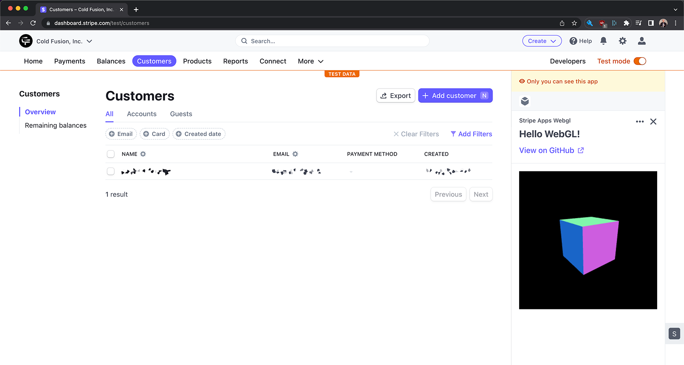

# stripe-apps-webgl

Implementing WebGL within a Stripe App (using [Three.js](https://github.com/mrdoob/three.js/))

## Screenshot

## Prerequisites

For Homebrew on macOS,

1. Install Stripe CLI: `brew install stripe/stripe-cli/stripe`
2. Install Stripe Apps CLI plugin: `stripe plugin install apps`

For more info, see: https://stripe.com/docs/stripe-apps/create-app

## Building

1. Clone this repo
2. Run `yarn install`
3. Run `stripe apps start`

## How It Works

As Stripe Apps run in an sandboxed iframe and do not have direct access to the DOM, and there (currently) is no [UI Component](https://stripe.com/docs/stripe-apps/components) in the Stripe Apps that can be used to obtain access to a HTML Canvas, it is not possible to directly render GPU output into a Stripe App.

Stripe Apps do however support display of images, specifically images that can be specified via [data URLs](https://stripe.com/docs/stripe-apps/components/img#data-urls), which can be generated and encoded at runtime.  Using this method, we can render WebGL output into a buffer, copy out the final rendered frame, encode the frame into an image, and display it within the app's view.

## Animation

TODO

## Input

TODO
